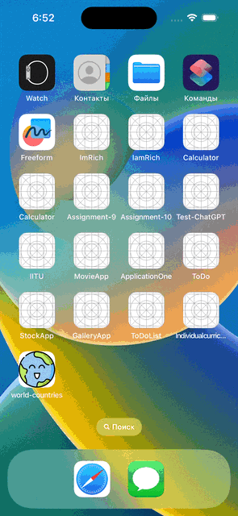

<h1 align="center">
  :kazakhstan:	 World Countries Application :kazakhstan:	
</h1>

## Demonstration
Video demonstration with full basic functionality, as well as all additional functionality

## Advanced

**1: Use programmatic Autolayout (or Autolayout + Snapkit)**
I used SnapKit in development

---
**2: Use “skeleton views” for all the elements while API requests are performed**
Skeleton View loader that lasts until the models are loaded

 
 ---
**3: Make the UI look and feel good for all the screen sizes including iPads**
The UI was completely made based on Figma. On the iPad, the app works correctly and displays all the data correctly

---
**4: Make the expand/collapse feature for CountriesList animated, with no UI bugs**
The cell expansion function was also implemented by standards. Has no bugs or errors in the display

---
**5: Add the images caching and reuse them from cache (don’t download any image twice)**
I used the KingFisher library. It has caching under the hood, and it performs its functions perfectly

---
**6: Use “nice” naming (common readability, self-documenting code)**
During the development, the SOLID principle was strictly observed, the use of comments to explain important and complex points. The names of the variables were chosen based on the understandable in view of the abbreviation or designation of the function

---
**7: Follow any of the architectures (MVC, MVVM, VIPER etc.)**
I chose the MVVM design architecture. The architecture is extremely reliable and modern, so I chose it

---
**9: Write safe code, leave no possibility of crashes (correct optionals, array indices handling etc.)**
All optional data has been processed, and does not give any errors. For errors in the form of network problems, I wrote an alert that notifies the user about the error

---
**10: Make the “Capital coordinates” latitude + longitude value on the CountryDetails screen tappable; on tap open the link obtained from the “maps → openStreetMaps”**
The coordinates were calculated and a Gesture was also added to click on the coordinates. After that, it transfers the user to google maps

---
**11: Add the pushes feature:**
  
**a) Make the push notification appear after 1-5 seconds after the app launch - 1 point;**
The sendNotification function is based on the implementation of sending a notification, and the sending interval is randomly made in the range from 1 to 5

  
**b) The push should contain random country basic info - 1 point;** 
The variable random Country was output to a common class, and randomly selects a model. The name of the country and its capital are transmitted to the display

  
**c) The user’s tap should be handled by opening the corresponding country’s CountryDetails screen - 1 point.**
When you click on the notification, it translates to the same model in a more detailed form.

