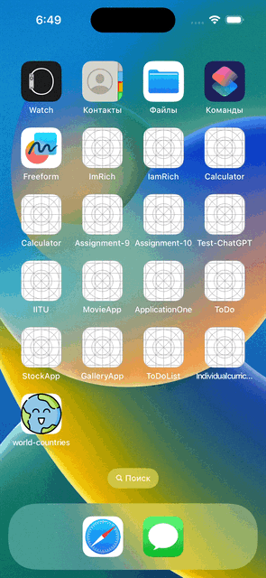
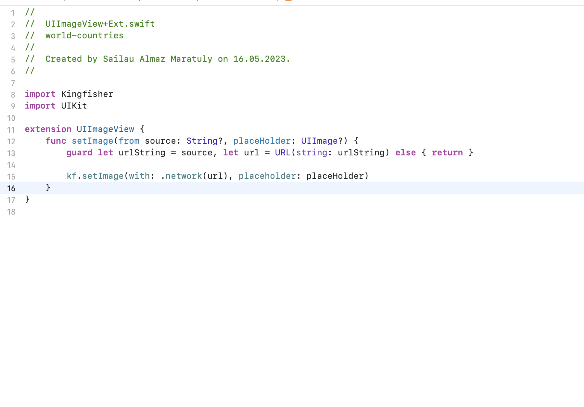

<h1 align="center">
  :kazakhstan:	 World Countries Application :kazakhstan:	
</h1>

## Demonstration

## Advanced

1: Use programmatic Autolayout (or Autolayout + Snapkit)

---
2: Use “skeleton views” for all the elements while API requests are performed

 
 ---
3: Make the UI look and feel good for all the screen sizes including iPads

---
4: Make the expand/collapse feature for CountriesList animated, with no UI bugs

---
5: Add the images caching and reuse them from cache (don’t download any image twice)

---
6: Use “nice” naming (common readability, self-documenting code)

---
7: Follow any of the architectures (MVC, MVVM, VIPER etc.)

---
8: Add basic non-UI tests coverage

---
9: Write safe code, leave no possibility of crashes (correct optionals, array indices handling etc.)

---
10: Make the “Capital coordinates” latitude + longitude value on the CountryDetails screen tappable; on tap open the link obtained from the “maps → openStreetMaps”

---
11: Add the pushes feature:
  
a Make the push notification appear after 1-5 seconds after the app launch - 1 point;

  
b The push should contain random country basic info - 1 point; 

  
c The user’s tap should be handled by opening the corresponding country’s CountryDetails screen - 1 point.

